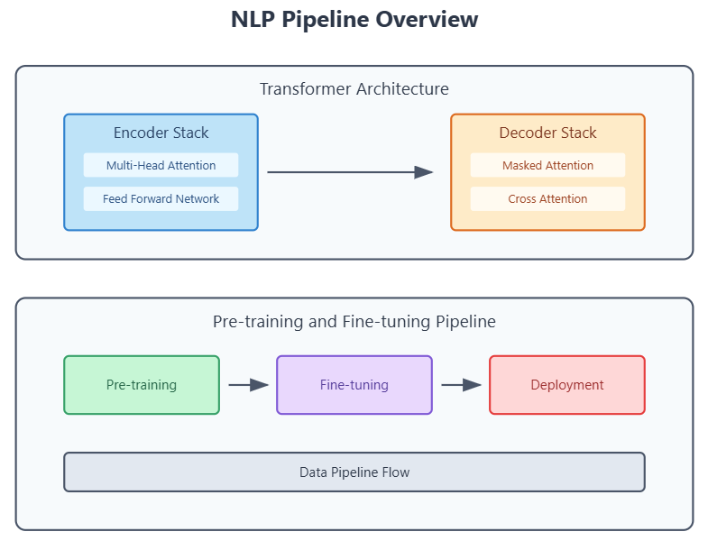

# NLP-Transformers-from-Scratch

## Overview
This project is part of the "Natural Language Processing Demystified" series and explores the fundamentals of transformer architectures, pre-training, and transfer learning in NLP. It covers the step-by-step implementation of a transformer model from scratch and fine-tuning pre-trained models using Hugging Face's `transformers` library.



## Requirements
Ensure you have the following installed:
- Python 3.8+
- TensorFlow 2.x
- NumPy
- Hugging Face `transformers` library
- `datasets` library
- `bpemb` library

You can install the required packages using:
```bash
pip install tensorflow numpy transformers datasets bpemb
```

## Features
### 1. Building a Transformer from Scratch
- Implements multi-head self-attention
- Implements encoder and decoder blocks
- Uses positional and token embeddings
- Constructs an entire transformer model

### 2. Pre-training and Transfer Learning
- Uses Hugging Face's `transformers` library
- Fine-tunes a pre-trained transformer model on the SQuAD dataset
- Demonstrates tokenization, attention masks, and dataset preparation

### 3. Question Answering with a Fine-Tuned Model
- Extracts answers from given contexts
- Fine-tunes `distilroberta-base` for extractive question answering
- Uses `TFAutoModelForQuestionAnswering` from Hugging Face

## Usage
### Running the Transformer from Scratch
To execute the transformer model built from scratch, run the Python script:
```bash
python nlpdemystified_transformers_and_pretraining.py
```

### Fine-tuning a Pre-trained Model
To fine-tune `distilroberta-base` on SQuAD:
```python
from transformers import TFAutoModelForQuestionAnswering, AutoTokenizer

model_name = 'distilroberta-base'
tokenizer = AutoTokenizer.from_pretrained(model_name)
model = TFAutoModelForQuestionAnswering.from_pretrained(model_name)
```

### Using the Fine-Tuned Model for Question Answering
```python
def get_answer(tokenizer, model, question, context):
    inputs = tokenizer([question], [context], return_tensors="np")
    outputs = model(inputs)
    start_position = tf.argmax(outputs.start_logits, axis=1)
    end_position = tf.argmax(outputs.end_logits, axis=1)
    answer = inputs["input_ids"][0, int(start_position) : int(end_position) + 1]
    return tokenizer.decode(answer).strip()
```

## Notes
- **Enable GPU acceleration** in Colab for faster execution: `Runtime > Change Runtime Type > GPU`.
- Run notebooks locally to prevent Colab timeouts: [Colab Local Runtime](https://research.google.com/colaboratory/local-runtimes.html).

## References
- [Attention Is All You Need (Original Transformer Paper)](https://arxiv.org/abs/1706.03762)
- [Hugging Face Transformers Documentation](https://huggingface.co/docs/transformers/)
- [BERT: Pre-training of Deep Bidirectional Transformers](https://arxiv.org/abs/1810.04805)

## License
This project is licensed under the MIT License.

